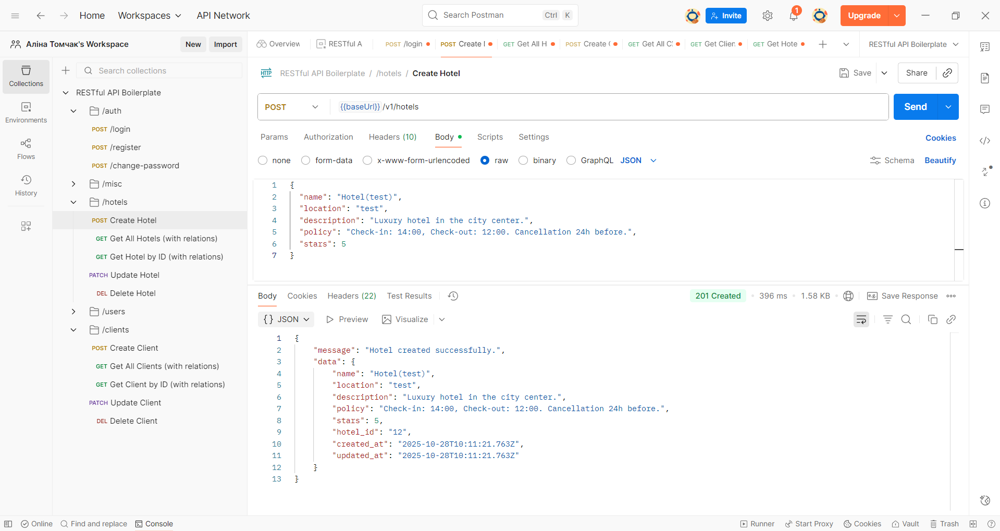
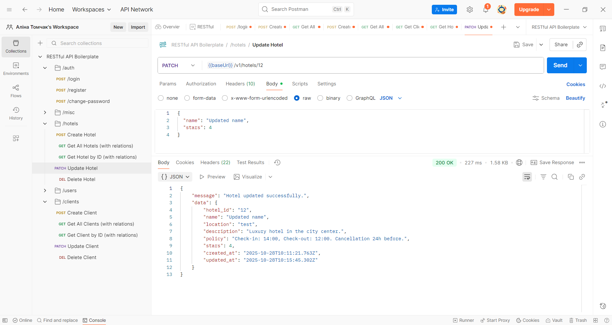
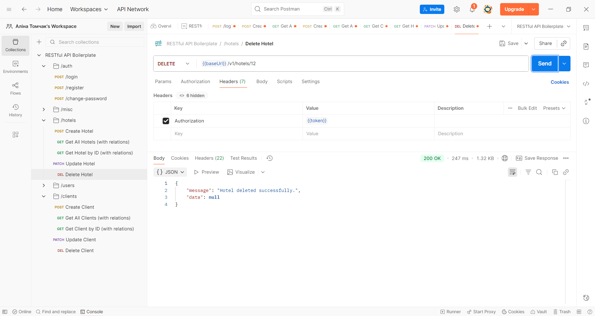
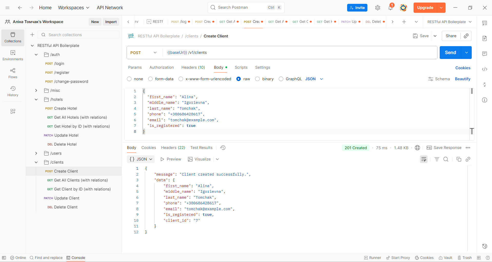
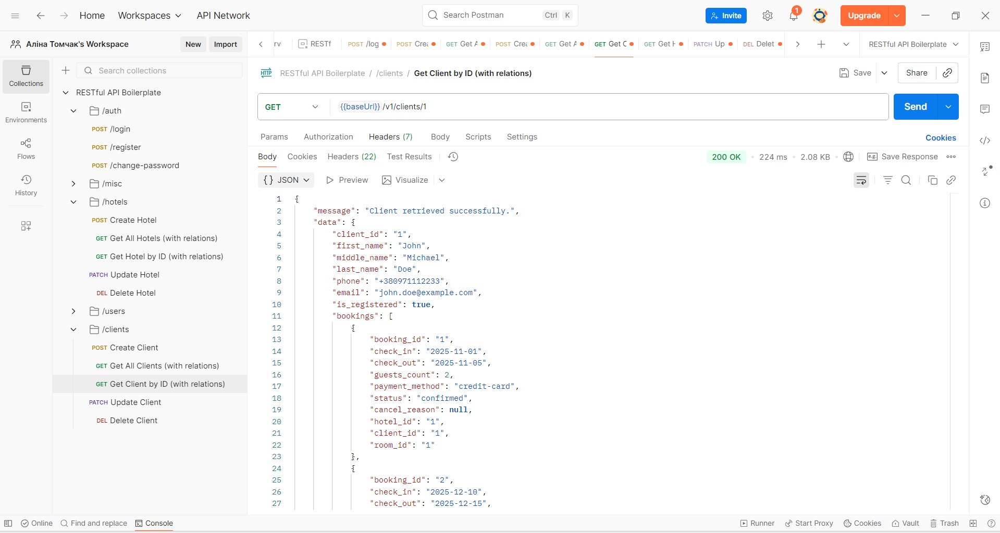
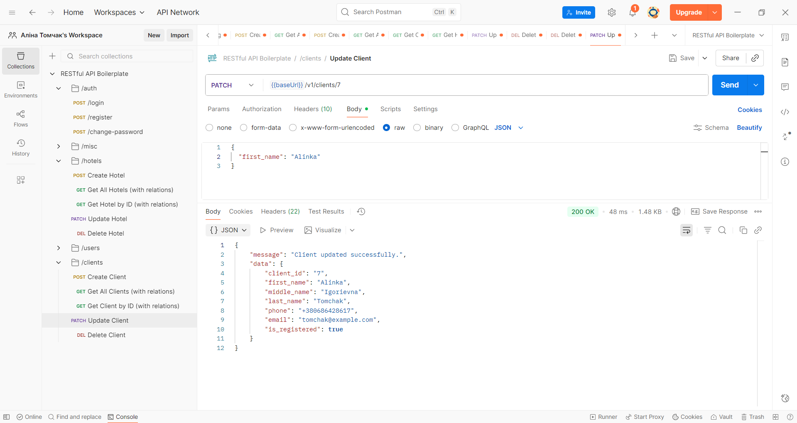
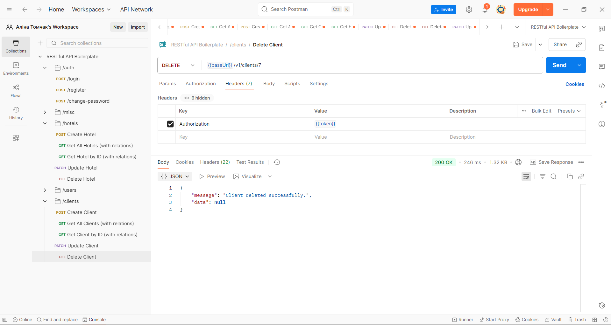

#  TypeORM / Express / TypeScript RESTful API boilerplate

[![CI][build-badge]][build-url]
[![TypeScript][typescript-badge]][typescript-url]
[![prettier][prettier-badge]][prettier-url]

Boilerplate with focus on best practices and painless developer experience:

- Minimal setup that can be extended 🔧
- Spin it up with single command 🌀
- TypeScript first
- RESTful APIs
- JWT authentication with role based authorization

## Requirements

- [Node v16+](https://nodejs.org/)
- [Docker](https://www.docker.com/)

## Running

_Easily set up a local development environment with single command!_

- clone the repo
- `npm run docker:dev` 🚀

Visit [localhost:4000](http://localhost:4000/) or if using Postman grab [config](/postman).

### _What happened_ 💥

Containers created:

- Postgres database container seeded with 💊 Breaking Bad characters in `Users` table (default credentials `user=walter`, `password=white` in [.env file](./.env))
- Node (v16 Alpine) container with running boilerplate RESTful API service
- and one Node container instance to run tests locally or in CI

## Features:

- [Express](https://github.com/expressjs/express) framework
- [TypeScript v4](https://github.com/microsoft/TypeScript) codebase
- [TypeORM](https://typeorm.io/) using Data Mapper pattern
- [Docker](https://www.docker.com/) environment:
  - Easily start local development using [Docker Compose](https://docs.docker.com/compose/) with single command `npm run docker:dev`
  - Connect to different staging or production environments `npm run docker:[stage|prod]`
  - Ready for **microservices** development and deployment.  
    Once API changes are made, just build and push new docker image with your favourite CI/CD tool  
    `docker build -t <username>/api-boilerplate:latest .`  
    `docker push <username>/api-boilerplate:latest`
  - Run unit, integration (or setup with your frontend E2E) tests as `docker exec -ti be_boilerplate_test sh` and `npm run test`
- Contract first REST API design:
  - never break API again with HTTP responses and requests payloads using [type definitions](./src/types/express/index.d.ts)
  - Consistent schema error [response](./src/utils/response/custom-error/types.ts). Your frontend will always know how to handle errors thrown in `try...catch` statements 💪
- JWT authentication and role based authorization using custom middleware
- Set local, stage or production [environmental variables](./config) with [type definitions](./src/types/ProcessEnv.d.ts)
- Logging with [morgan](https://github.com/expressjs/morgan)
- Unit and integration tests with [Mocha](https://mochajs.org/) and [Chai](https://www.chaijs.com/)
- Linting with [ESLint](https://eslint.org/)
- [Prettier](https://prettier.io/) code formatter
- Git hooks with [Husky](https://github.com/typicode/husky) and [lint-staged](https://github.com/okonet/lint-staged)
- Automated npm & Docker dependency updates with [Renovate](https://github.com/renovatebot/renovate) (set to patch version only)
- Commit messages must meet [conventional commits](https://www.conventionalcommits.org/en/v1.0.0/) format.  
  After staging changes just run `npm run commit` and get instant feedback on your commit message formatting and be prompted for required fields by [Commitizen](https://github.com/commitizen/cz-cli)

## Other awesome boilerplates:

Each boilerplate comes with it's own flavor of libraries and setup, check out others:

- [Express and TypeORM with TypeScript](https://github.com/typeorm/typescript-express-example)
- [Node.js, Express.js & TypeScript Boilerplate for Web Apps](https://github.com/jverhoelen/node-express-typescript-boilerplate)
- [Express boilerplate for building RESTful APIs](https://github.com/danielfsousa/express-rest-es2017-boilerplate)
- [A delightful way to building a RESTful API with NodeJs & TypeScript by @w3tecch](https://github.com/w3tecch/express-typescript-boilerplate)

[build-badge]: https://github.com/mkosir/express-typescript-typeorm-boilerplate/actions/workflows/main.yml/badge.svg
[build-url]: https://github.com/mkosir/express-typescript-typeorm-boilerplate/actions/workflows/main.yml
[typescript-badge]: https://badges.frapsoft.com/typescript/code/typescript.svg?v=101
[typescript-url]: https://github.com/microsoft/TypeScript
[prettier-badge]: https://img.shields.io/badge/code_style-prettier-ff69b4.svg
[prettier-url]: https://github.com/prettier/prettier

## Contributing

All contributions are welcome!

# Лабораторно-практична робота №5: Розширення бекенд-додатку та REST API

## Тема: Реалізація REST API для управління готельною системою (Hotel Management System)

### Реалізовані Сутності та Зв'язки

На основі проєкту бази даних готельної системи були
реалізовані ключові сутності та їхні реляційні зв'язки
за допомогою декораторів TypeORM.

- Hotel - виступає центральною сутністю, що має зв'язки
  @OneToMany з більшістю інших сутностей. Це дозволяє
  при запиті одного готелю одразу отримувати всі його
  ресурси
- Client - сутність, що зберігає інформацію про гостей,
  включаючи first_name, last_name, а також унікальні
  phone та email. Ключовим зв'язком є One-to-Many до Booking,
  що дозволяє відстежувати всі бронювання, здійснені
  конкретним клієнтом.
- Room описує конкретні номери. Ключові поля включають
  унікальний room_number, price_per_night та capacity.
  Поле comfort_level та status мають строгі обмеження
  @Check. Сутність має зв'язок Many-to-One до Hotel,
  що вказує, якому саме готелю належить цей номер.
- Employee - містить дані про персонал. Подібно до Room, вона має зв'язок
  Many-to-One до Hotel, вказуючи місце роботи співробітника. Зв'язок
  реалізовано з опцією onDelete: 'CASCADE' для підтримки цілісності даних.
- Service - сутність, що описує додаткові послуги,
  які може надавати готель. Вона також має зв'язок
  Many-to-One до Hotel, прив'язуючи послугу до конкретного закладу.
- Booking є транзакційною сутністю, яка фіксує факт
  бронювання. Вона є ключовою для реляційної моделі,
  оскільки має три зв'язки Many-to-One, що створюють композитний зв'язок:до Hotel (де відбулося бронювання),
  до Client (хто забронював), до Room (який номер було заброньовано).

### Реалізовані API ендпоінти

Для сутностей Hotel та Client реалізовано повний набір CRUD-операцій.

#### Ендпоінти для управління Готелями

- POST /api/v1/hotels - cтворення нового готелю
- GET /api/v1/hotels - отримання списку всіх готелів
  (включає пов'язані: rooms, employees, services, bookings)
- GET /api/v1/hotels/{id} - отримання готелю за ID
  (включає пов'язані: rooms, employees, services, bookings)
- PATCH /api/v1/hotels/{id} - оновлення інформації про готель за ID
- DELETE /api/v1/hotels/{id} - видалення готелю за ID

#### Ендпоінти для управління Клієнтами

- POST /api/v1/clients - створення нового клієнта
- GET /api/v1/clients - отримання списку всіх клієнтів(включає пов'язані: bookings)
- GET /api/v1/clients/{id} - отримання клієнта за ID(включає пов'язані: bookings)
- PATCH /api/v1/clients/{id} - оновлення інформації про клієнта за ID
- DELETE /api/v1/clients/{id} - видалення клієнта за ID

### Тестування API через Postman

Нижче наведені скріншоти відповідно

### Готель

#### POST /api/v1/hotels

#### GET /api/v1/hotels

.png)
.png)
.png)
.png)

#### GET /api/v1/hotels/{id}

.png)
.png)
.png)
.png)

#### PATCH /api/v1/hotels/{id}

#### DELETE /api/v1/hotels/{id}

### Клієнт

#### POST /api/v1/clients

#### GET /api/v1/clients

.png)
.png)
.png)

#### GET /api/v1/clients/{id}

#### PATCH /api/v1/clients/{id}

#### DELETE /api/v1/clients/{id}

